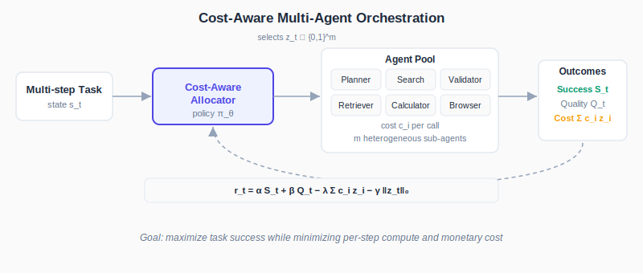
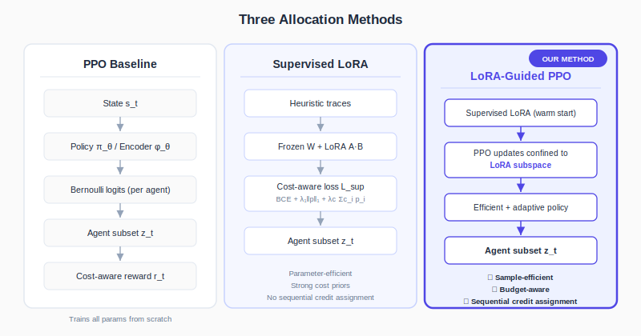
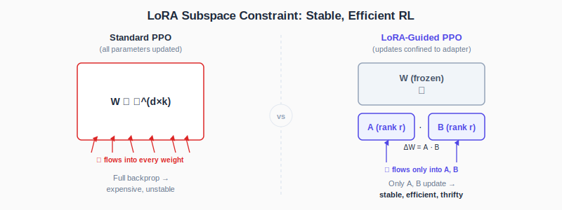
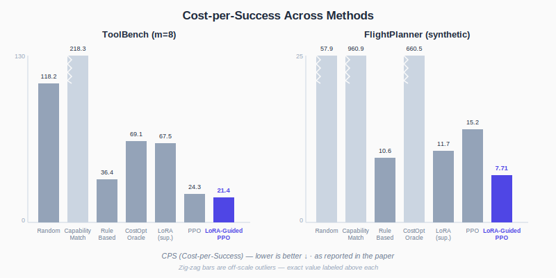
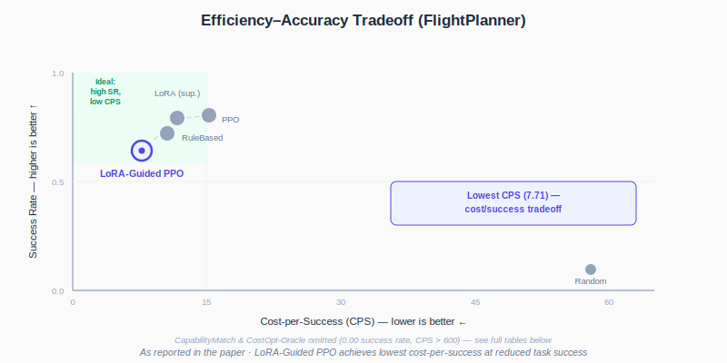

# LoRA-Guided PPO for Cost-Aware and Compute-Efficient Agent Orchestration

[](https://neurips.cc/virtual/2025/loc/san-diego/126604)
[](paper/lora-guided-ppo-neurips2025.pdf)

> **Accepted at the First Workshop on Efficient Reasoning, NeurIPS 2025 (San Diego).**
> Proof of acceptance: **https://neurips.cc/virtual/2025/loc/san-diego/126604**

**Aneesh Durai**¹ · **Joshua Cong Hu**² · **Kevaan Buch**² · **Kevin Zhu**³ · **Vasu Sharma**⁴ · **Aishwarya Balwani**⁵

¹Columbia University · ²University of Toronto · ³Algoverse AI Research · ⁴FAIR at Meta · ⁵St. Jude Children's Research Hospital

---

> This repository presents the paper, its method, and its published results — it does not contain the original experiment code. See [What this repo is](#what-this-repo-is) below.

## Abstract

A fundamental challenge in multi-agent reasoning systems is **budget-aware allocation**: deciding which sub-agents to invoke across multiple steps while balancing success against computational and monetary cost. We formalize this setting as a cost-constrained sequential decision problem and propose a hybrid policy that integrates parameter-efficient pretraining with reinforcement learning. A **LoRA adapter** captures cost-sensitive priors from heuristic traces, and **Proximal Policy Optimization (PPO)** fine-tunes only this low-rank subspace — stabilizing optimization, improving sample efficiency, and preserving allocation thrift while enabling sequential credit assignment.

On a ToolBench-style benchmark, the hybrid achieves **perfect success** while reducing cost-per-success (CPS) by **12%** relative to PPO (21.40 vs. 24.30). In the synthetic FlightPlanner setting, it achieves the **lowest CPS** (7.71) among evaluated methods. The results demonstrate that combining parameter-efficient fine-tuning with RL yields controllers that are both adaptive and budget-aware — a practical recipe for efficient reasoning under real-world resource constraints.

## The Problem

Reasoning in complex domains often requires orchestrating multiple sub-agents — retrievers, planners, calculators, validators — across several turns. Every additional call consumes FLOPs, increases latency, and incurs monetary cost. System designers face a fundamental trade-off: invoke more agents to maximize reliability, or conserve resources and risk incomplete or incorrect solutions.

<p align="center"></p>

Existing strategies fall short in different ways. **Heuristic / rule-based** methods are lightweight but brittle. **RL methods** like PPO adapt dynamically but demand heavy training budgets, are unstable in high-variance environments, and often overspend on expensive agents. **Parameter-efficient fine-tuning** (LoRA) reduces training overhead but, alone, lacks a mechanism for sequential credit assignment across turns.

## The Method

The paper formalizes allocation as a sequential decision problem: at each step, an allocator observes state $s_t$ and selects a subset $z_t \in \{0,1\}^m$ of agents to invoke, optimizing a reward that makes efficiency a first-class objective:

$$r_t = \alpha S_t + \beta Q_t - \lambda \sum_i c_i z_{t,i} - \gamma \|z_t\|_0$$

balancing **success** ($S_t$), **quality** ($Q_t$), and **cost** ($c_i$ per agent) — equivalent to a Lagrangian relaxation of a constrained MDP.

Three allocators are compared:

<p align="center"></p>

- **PPO baseline** — a from-scratch RL policy with clipped surrogate objective, entropy regularization, and a critic head; learns to succeed *and* economize via the cost-aware reward, but at a high training budget.
- **Supervised LoRA** — a parameter-efficient allocator trained on greedy heuristic traces with a cost-aware loss (BCE + sparsity + cost penalties). Minimal training cost, strong priors, but no sequential credit assignment.
- **LoRA-Guided PPO (proposed)** — warm-starts from the supervised LoRA model and restricts all PPO updates to the LoRA subspace. This is the paper's central contribution:

<p align="center"></p>

By freezing the base weights $W$ and updating only the low-rank adapter $\Delta W = AB$ ($r \ll d, k$), RL fine-tuning is anchored in a stable, lightweight subspace — retaining cost-efficient priors while still enabling adaptive, sequential decision-making.

## Results

Evaluated across two environments: a synthetic **FlightPlanner** (multi-leg itinerary planning, 5–7 turns, planner/search/validator agents) and a **ToolBench-style** benchmark (8 heterogeneous tools, 3–5 turns). Each result aggregates over 400 sampled trajectories.

<p align="center"></p>

**ToolBench is the clean win:** LoRA-Guided PPO reaches **perfect success (1.0000)** — matching PPO and supervised LoRA — while achieving the **lowest cost-per-success (21.40 vs. 24.30 for PPO, a 12% reduction)** and the lowest FLOPs/Success.

**FlightPlanner is a genuine cost/success trade-off, not a clean win:** LoRA-Guided PPO achieves the lowest CPS (7.71) and lowest FLOPs/Success by a wide margin, but at a *lower* success rate (0.6425) than PPO (0.8025) or supervised LoRA (0.79). The visualization below makes this trade-off explicit rather than glossing over it:

<p align="center"></p>

### Table 1 — FlightPlanner (synthetic)

*As reported in the paper.*

| Method | Success Rate ↑ | CPS ↓ | FLOPs/Success ↓ |
|---|---|---|---|
| Random | 0.0975 | 57.88 | 5.47 × 10¹² |
| CapabilityMatch | 0.0000 | 960.90 | 8.60 × 10¹³ |
| RuleBased | 0.7200 | 10.58 | 9.80 × 10¹¹ |
| CostOpt-Oracle | 0.0000 | 660.50 | 4.67 × 10¹³ |
| LoRA (supervised) | 0.7900 | 11.70 | 1.18 × 10¹² |
| PPO | **0.8025** | 15.23 | 1.46 × 10¹² |
| **LoRA-Guided PPO** | 0.6425 | **7.71** | **4.73 × 10¹¹** |

### Table 2 — ToolBench benchmark (pool size m=8)

*As reported in the paper.*

| Method | Success Rate ↑ | CPS ↓ | FLOPs/Success ↓ |
|---|---|---|---|
| Random | 0.1925 | 118.23 | 2.84 × 10¹² |
| CapabilityMatch | 0.0800 | 218.25 | 4.72 × 10¹² |
| RuleBased | 1.0000 | 36.43 | 8.35 × 10¹¹ |
| CostOpt-Oracle | 0.1625 | 69.13 | 1.44 × 10¹² |
| LoRA (supervised) | 1.0000 | 67.51 | 1.73 × 10¹² |
| PPO | 1.0000 | 24.30 | 4.38 × 10¹¹ |
| **LoRA-Guided PPO** | **1.0000** | **21.40** | **4.38 × 10¹¹** |

### Metrics glossary

- **Success Rate** — fraction of tasks whose final output satisfies all hard constraints.
- **CPS (Cost-per-Success)** — total cost (monetary / FLOPs proxy) divided by number of successful tasks.
- **FLOPs/Success** — total floating-point operations divided by successful tasks; a compute-efficiency proxy.

## What This Repo Is

This repository is a **presentation artifact** for the published paper — built to make the credential, the method, and the published results easy to find and read. It intentionally does **not** include the original training code, environments, or experiment harness. If you're looking to reproduce or extend the work, start from the paper itself (linked above) and the references therein.

## Citation

```bibtex
@inproceedings{durai2025loraguidedppo,
  title     = {{LoRA-Guided PPO for Cost-Aware and Compute-Efficient Agent Orchestration}},
  author    = {Durai, Aneesh and Hu, Joshua Cong and Buch, Kevaan and Zhu, Kevin and Sharma, Vasu and Balwani, Aishwarya},
  booktitle = {NeurIPS 2025 Workshop on Efficient Reasoning},
  year      = {2025},
  url       = {https://neurips.cc/virtual/2025/loc/san-diego/126604}
}
```

## License

[MIT](LICENSE) — paper content and figures are presented for attribution and reference; please cite the paper if you build on this work.
